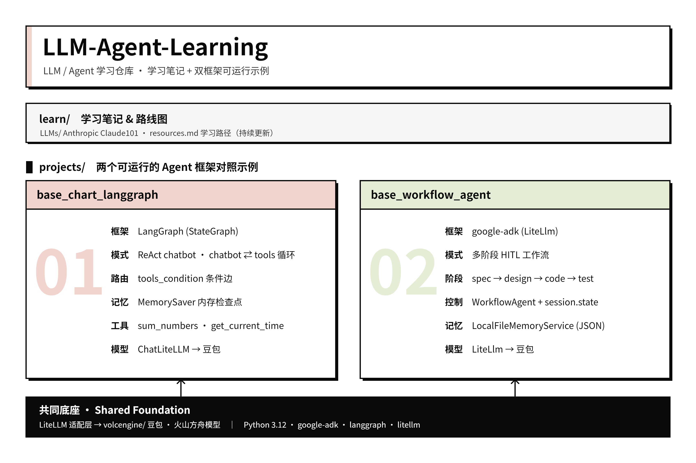

# LLM-Agent-Learning

记录 LLM、Agent 等 AI 相关知识的学习路径与方法，并配套两个可运行的 Agent 框架对照示例。

## 仓库架构



## 目录结构

- `learn/`：学习笔记与精选资料
  - `learn/LLMs/`：大语言模型相关笔记（如 Anthropic Claude 101）
  - `learn/resources.md`：学习路线图与资料汇总（持续更新）
- `projects/`：两个可运行的 Agent 框架对照示例
  - `base_chart_langgraph/`：基于 LangGraph 的 ReAct chatbot 示例
  - `base_workflow_agent/`：基于 google-adk 的多阶段 HITL 工作流示例
  - `devops_agent/`：基于 google-adk 的企业级 DevOps 智能运维 Agent 示例
  - `requirements.txt`：项目依赖声明
- `AGENTS.md`：面向协作者 / Agent 的仓库约定
- `pyrightconfig.json`：Pyright/Pylance 类型检查与虚拟环境配置

## 示例项目

### 1. base\_chart\_langgraph

基于 **LangGraph** 的 ReAct chatbot 最小示例：

- `StateGraph` 构建 `chatbot ⇄ tools` 循环，由 `tools_condition` 做条件路由
- `MemorySaver` 提供内存检查点（按 `thread_id` 维持多轮上下文）
- 内置工具：`sum_numbers`、`get_current_time`
- 通过 `ChatLiteLLM` 接入豆包（火山方舟）模型
- 入口：`projects/base_chart_langgraph/agent.py`

### 2. base\_workflow\_agent

基于 **google-adk** 的多阶段 Human-in-the-Loop 开发工作流示例：

- 自定义 `WorkflowAgent` 串联 `spec → design → code → test` 四个阶段
- 统一聊天输入确认：用户回复 `OK` 推进下一阶段，给出反馈则带「原始需求 + 上一版产出 + 反馈」重做当前阶段
- 通过 `session.state`（`EventActions.state_delta`）持久化流程状态
- `LocalFileMemoryService` 将记忆落地为本地 JSON 文件，重启不丢失
- 通过 `LiteLlm` 接入豆包（火山方舟）模型
- 入口：`projects/base_workflow_agent/agent.py`

### 3. devops\_agent

基于 **google-adk** 的企业级 DevOps 智能运维（AIOps/SRE）参考 Agent，集中演示 Skill /
MCP / SubAgent / 记忆 / 支持库等常用能力，并对齐 kagent、Autonomous SRE Agent、Akmatori
等业界优秀实践：

- **Supervisor + 专家 SubAgent**：根 Agent 路由委派给 `diagnostics`（诊断）/
  `remediation`（处置）/ `communicator`（沟通）三个专家子代理
- **端口-适配器解耦**：运维 Skill 经 Provider 接口执行，默认 `MockAdapter`（只读、可离线），
  预留真实 Prometheus/K8s/CI 适配器扩展点
- **用户自定义 Skill**：业界标准 Agent Skills 形态——每个 Skill 是 `devops_agent/skills/`
  下的一个文件夹（含 `SKILL.md` + 可选 `reference/scripts/assets`，可用 `DEVOPS_SKILLS_DIR`
  指定），启动渐进式披露目录，模型按需 `load_skill` 读取完整 SOP；坏 Skill 跳过不影响启动
- **生产级安全护栏**：危险/写操作（如回滚）默认进入人审批门（HITL），拒绝理由回传 LLM；
  工具调用全程审计；提供调用次数预算上限
- **可观测性**：stdout 结构化日志（脱敏）+ 审计落盘，预留 OpenTelemetry 追踪 hook
- **记忆管理**：本地 JSON 持久化 `MemoryService`，重启不丢失；预留向量库 / runbook RAG 扩展点
- **可选 MCP**：通过 `McpToolset` 接入本地 filesystem MCP，开关控制、可优雅降级
- 入口：`projects/devops_agent/agent.py`（`adk`）与 `projects/devops_agent/cli.py`（独立 CLI）

## 环境与运行

要求 **Python >=3.12,<3.13**。依赖与虚拟环境均位于 `projects/` 目录下。

```bash
cd projects
python -m venv .venv
source .venv/bin/activate
pip install -r requirements.txt
```

在 `projects/` 下创建 `.env` 配置模型与密钥：

```bash
MODEL_NAME=your-model-name
ARK_API_KEY= your-API-Key
```

运行示例：

```bash
# LangGraph 示例
python base_chart_langgraph/agent.py

# google-adk 工作流示例（通过 ADK CLI）
adk run base_workflow_agent

# DevOps 智能运维 Agent
adk run devops_agent          # CLI（ADK 原生）
adk web                       # 对话式 Web，选择 devops_agent
python -m devops_agent.cli --prompt "查看 order-service 健康状态"   # 独立 CLI（单次）
python -m devops_agent.cli                                          # 独立 CLI（交互式 REPL）
```

> `devops_agent` 可选环境变量：`DEVOPS_ENABLE_MCP`（启用 filesystem MCP）、
> `DEVOPS_REQUIRE_APPROVAL`（默认 true，危险操作需审批）、`DEVOPS_MAX_TOOL_CALLS`
> （工具调用预算）、`DEVOPS_PROVIDER_BACKEND`（默认 mock）。

